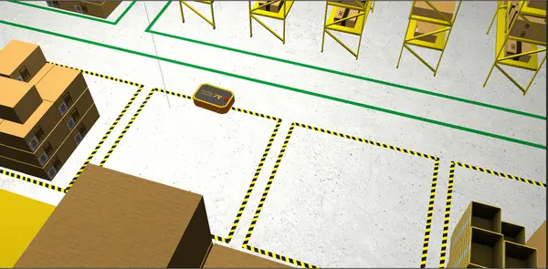
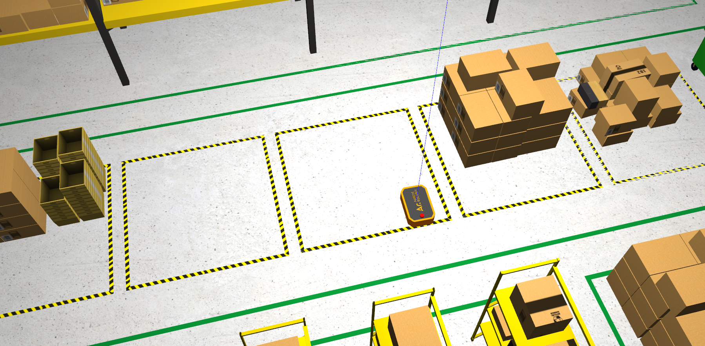
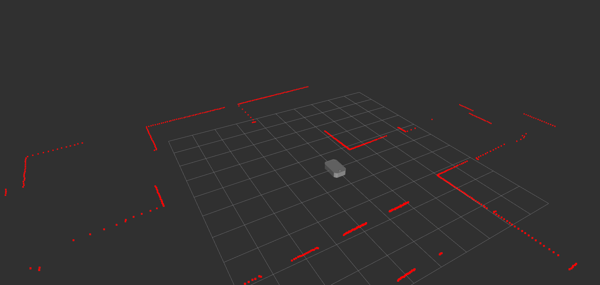
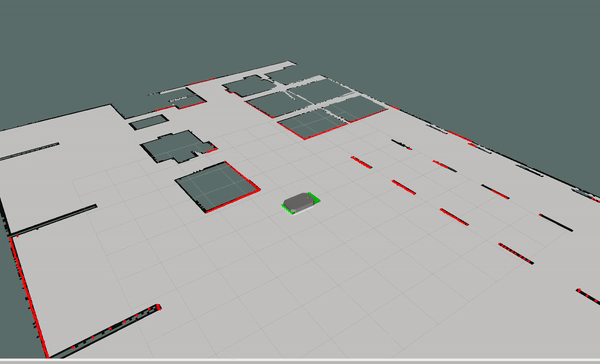

# Apricot Robotics Assignment by Yash Jangir

This repository is solution to the assigment by Apricot Robotics - https://github.com/Apricot-Robotics/ar1

Make Sur you have installed ROS Noetic on Ubuntu 20.04 - http://wiki.ros.org/noetic/Installation/Ubuntu


<div style="text-align:center;">
  
</div>

# Setup

Clone the repository into your workspace
```
git clone https://github.com/offjangir/Assignment_apricot/tree/main
```

# Installing Dependecies and Required Packages

- The soultion uses Ros Navigation Stack and Hector_slam for the Navigation, Localization and Mapping task.

- Install the dependencies by following terminal commands.

```
sudo apt install ros-noetic-navigation
sudo apt-get install ros-noetic-hector-slam
```

- Major packges in Nav stack to be used would be move_base, amcl and map_server.


- Launch the main file. The robot should spawn in a warehouse environment

```
roslaunch ar1_description main.launch
```
<div>
  
  
</div>

## About the Robot - Given in the Assignment
- The main frame of reference is 'base_link'
- The robot has only 1 sensor and it publlishes its data to the /scan topic
- The drive topic of the robot is '/cmd_vel'
- The odometry topic and frame are 'odom'
- The footprint of the robot is 810mmx510mm with 'base_link' at its center

## Tasks
- [ ] There's an error in the robot's description package which won't show up as an error, but it might hinder your other tasks. Find out the error and correct it
- [ ] Setup a navigation stack for the robot. Use only the lidar data for mapping and navigation
  - Create a map with any package of your choice
  - Setup a navstack with any packages of your choice
  - Tune the parameters for the robot
- [ ] Write a Python/C++ script to send a sequence of navigation goals with the ROS action interface. Take at list of waypoints as input from the user and navigate to these points in order
- [ ] Write a Python/C++ script to publish RVIZ markers which tracks the path/area covered by the robot during the previous task


## Task 1 Robot Description Bug
- By watching the Laser scan from lider and robot model it is visible that there is some error in the joint defining as the scan is pi/2 rotated. To remove this the joint defination in the xacro can be changed as follows:

```
<!-- Dummy lidar joint -->
<joint name="lidar_dummy_joint" type="fixed">
  <origin xyz="0.0 0.0 .12" rpy="0 0 0" />
  <parent link="lidar_1"/>
  <child link="lidar_link" />
</joint>
```
- This would fix the laser scan issue and now the scans will match the right tranform required for the robot.


## Task 2 Navigation Stack and Mapping

<div style="text-align:center;">
  
</div>


- We already setup the navigation stack as required. Build the workspace with the packages and source it. 

- I have mapped the enviroment with and without the odometry using both gmapping package in nav stack and hector slam package which will only use lidar data

### Gmapping
- For Gmapping with the main file run the following command:

```
roslaunch gmapping slam_gmapping.launch
```

- In Rviz add map and choose the map topic for displaying.
- Use Teleop twist keyboard package for moving the robot and mapping the enviroment http://wiki.ros.org/teleop_twist_keyboard 
- Move robot slowly to map the enviroment perfectly
- When done use following map server package command to save the map.

```
rosrun map_server map_saver -f /path/to/map
```
- Saved Map for gmapping is in the ar1_description/params

### Hector SLAM - Uses only Lidar

- For hector slam with the main file run the following command:

```
roslaunch ar1_description main_hector_mapping.launch
```

- In Rviz add map and choose the map topic for displaying.
- Use Teleop twist keyboard package for moving the robot and mapping the enviroment http://wiki.ros.org/teleop_twist_keyboard 
- Move robot slowly to map the enviroment perfectly
- When done use following map server package command to save the map.

```
rosrun map_server map_saver -f /path/to/map
```
- Saved Map for hector slam is in the ar1_description/params

### Parameter Tuning and Navigation Enabling
- For using the Adaptive Monte Carlo Localization (AMCL) package and move_base package the costmaps and the params are already given in params file.
- For using the navigation stack we will launch map_server with both move_base and AMCL.

```
roslaunch ar1_description main.launch
roslaunch amcl amcl_diff.launch
roslaunch ar1_description move_base.launch
rosrun map_server map_server ar1_description/params/warehouse_map_hector.yaml
```

- Use Rviz to visualize the map and send goal 2d Goal targets


<div style="text-align:center;">
  
</div>

## Task 3 Script to send goal points

- Waypoint.py script takes number of goal points in sequence and coordinates and sends them as goal targets.

```
rosrun ar1_description waypoints.py
```

## Task 4 Marker publishing for path tracked

- Marker script publishes a cube marker of the base_footprint dimension by using the odometry. 
- Script keeps track of odometry position recieved and continuously sends the markers.
- Use Marker in Rviz to visualize the marks.

```
rosrun ar1_description marker.py
```
<div style="text-align:center;">
  
</div>